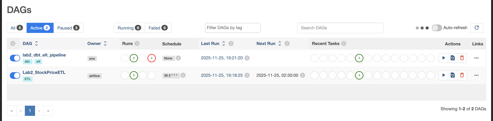
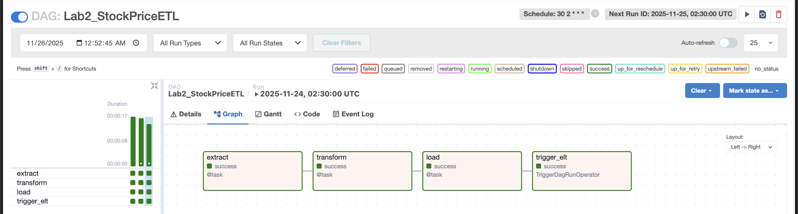
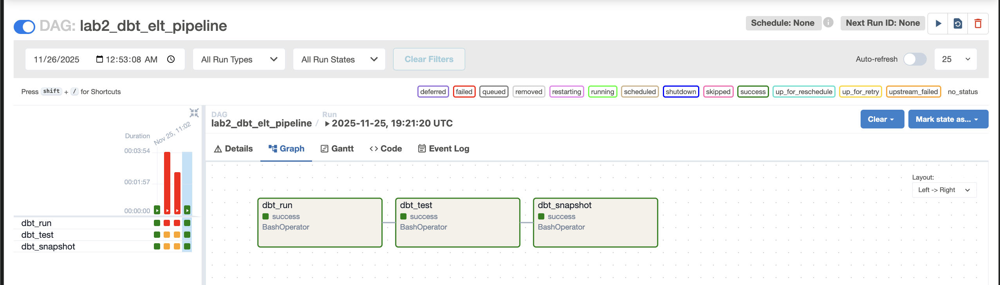
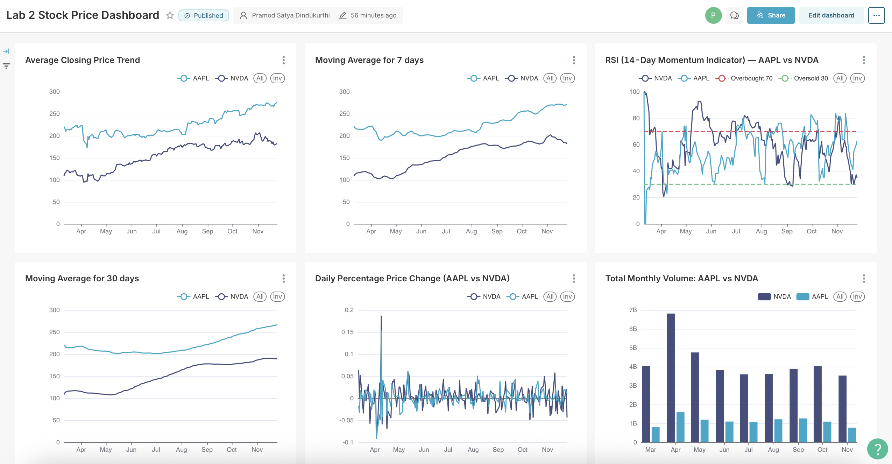

📈 Stock Analytics Pipeline (Airflow + dbt + Snowflake + Preset)

This project implements an end-to-end ELT pipeline for stock-market analytics using Apache Airflow, dbt, Snowflake, and Preset.
It automatically ingests OHLCV data from yfinance, transforms it using dbt models, stores the output in Snowflake, and visualizes technical indicators in Preset.

Required Files in this Lab 2 - stock_price_elt.py, dbt_elt_dag.py and dbt folder.

🚀 Project Overview
1. ETL with Airflow

DAGs inside dags/ handle:

Fetching OHLCV stock data via yfinance

Saving raw data locally (CSV/Parquet)

Loading raw data into Snowflake RAW table:
TWO_STOCK_V2

2. Transformations with dbt

The dbt project in dbt/stock_analytics cleans and models the data:

stg_stock_data → staging model

fct_stock_metrics → final analytical model with:

Daily percent change

7-day & 30-day moving averages

14-day RSI

3. Snowflake MART Layer

Final analytics table used by BI tools:

ANALYTICS.fct_stock_metrics

4. Visualization with Preset

Preset (Superset) reads directly from the Snowflake MART table and provides dashboards including:

Closing price trends

Monthly trading volume

Daily percent change

Moving averages

RSI with reference lines (30/70)

📁 Project Structure
airflow-docker/
│
├── dags/                        # Airflow DAGs
│   ├── stock_price_elt.py       # ETL (yfinance → Snowflake)
│   ├── dbt_elt_dag.py           # Executes dbt from Airflow
│   └── other dags...
│
├── dbt/
│   └── stock_analytics/         # dbt project
│       ├── models/
│       ├── snapshots/
│       ├── macros/
│       └── dbt_project.yml
│
├── docker-compose.yaml           # Airflow / Postgres / Redis / dbt
├── dockerfile                    # Custom Airflow image w/ dbt+Snowflake adapter
├── requirements.txt
└── README.md

🔄 Pipeline Flow
yfinance API
      ↓
Airflow ETL DAG (stock_price_elt.py)
      ↓
Snowflake RAW table (TWO_STOCK_V2)
      ↓
dbt transforms (stg_stock_data → fct_stock_metrics)
      ↓
Snowflake MART layer
      ↓
Preset dashboard (Price, Volume, RSI, Returns, MAs)

▶️ How to Run

Start Airflow + dbt

docker compose up -d

Airflow UI

http://localhost:8081

Trigger stock_price_elt → loads RAW data

Trigger dbt_elt_dag → builds MART model

View dashboards in Preset

🧰 Technology Stack

Apache Airflow

dbt Core

Snowflake

yfinance

Docker

Preset (Superset)

Preset Dashboard link - https://1c776e3e.us2a.app.preset.io/superset/dashboard/8/?native_filters_key=hnfiigzyQoH9WclvdeHIDlZyfRzoWJIAoPBp51dhTGPMHNtVLAqbMAkyJF9EQysF

Dashboard - 

📚 Purpose

This repo demonstrates a complete modern data stack: ingestion → transformation → analytics.
It is designed for academic work, portfolio projects, and learning end-to-end pipeline development.